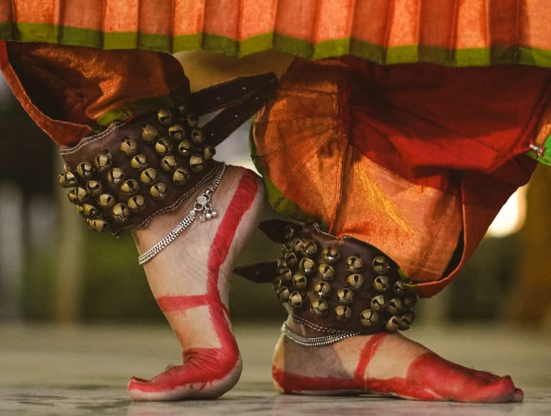
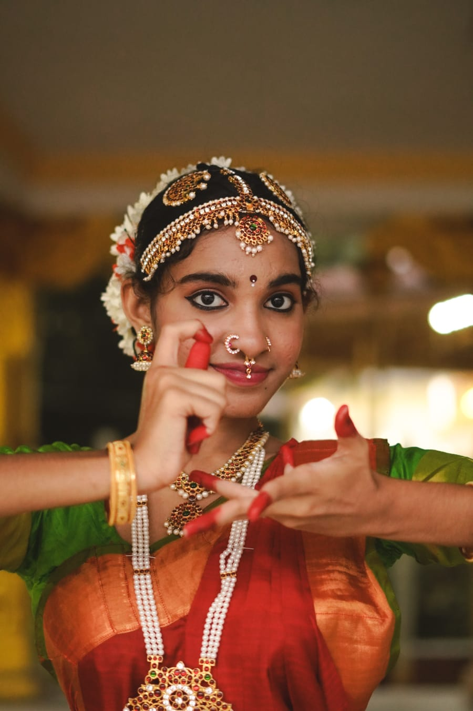

<!DOCTYPE html>
<html lang="en">
<head>
  <meta charset="UTF-8">
  <meta name="viewport" content="width=device-width, initial-scale=1">
  <title>NDA</title>
  <link rel="icon" type="image/png" href="dance-icon.png">
  <link rel="stylesheet" href="styles.css">
  <link rel="stylesheet" href="https://cdnjs.cloudflare.com/ajax/libs/font-awesome/6.5.0/css/all.min.css">
</head>

<body>

  <header>
      

    
    
    
  

<h1 style="font-family: Georgia, serif;">Nritasaha Dance Academy</h1>
    
    <nav>
      <ul>
        <li><a href="#about">About Us</a></li>
        <li><a href="#teachers">Our Teachers</a></li>
        <li><a href="#classes">Classes</a></li>
        <li><a href="#contact">Contact</a></li>
      </ul>
    </nav>
  </header>

  <section id="about">
<h2 style="font-family: Georgia, serif;">About Us</h2>
    
Welcome to Nritasaha Dance Academy, where tradition meets passion...

  
At Nritasaha Dance Academy, we specialize in Kuchipudi, a classical dance form from India that combines expressive storytelling with intricate footwork and vibrant costumes.

  
Our academy is dedicated to preserving and promoting this beautiful art form, offering classes for all ages and skill levels.

  
With over 11 years of experience in the classical art form of Kuchipudi, I am a dedicated student of Nishrinkala Dance Academy, founded by renowned danseuse Sandhya Raju. Under the esteemed guidance of Guru Gangadhar, I have honed my skills through years of disciplined practice and passionate performance. My journey in dance has been recognized at the international level, having secured 3rd place in an International Kuchipudi Dance Competition. Dance is not just an art to me—it's a lifelong expression of culture, emotion, and grace.

  
Our mission is to inspire and nurture the next generation of dancers, fostering a love for Kuchipudi and the performing arts.

  
Join us in celebrating the rich heritage of Kuchipudi and embark on a journey of artistic expression and cultural appreciation.

</section>
<section id="teachers">
  <h2 style="font-family: Georgia, serif;">Our Teachers</h2>
  
Meet our experienced and dedicated instructors who bring the art of Kuchipudi to life:

  

    

      
      

        <h3>Chinnamurthy Sahishna</h3>
        
Founder and Head Instructor

      

    

</section>

<section id="classes">
  <h2 style="font-family: Georgia, serif;">Dance Classes</h2>
  
Join our Kuchipudi dance classes, available in both online and offline modes to suit your convenience and learning style.

  
  

    

      <h3 style="text-align: center;">Online Mode</h3>
      
Learn from the comfort of your home through interactive virtual sessions.

      
<strong>Timings:</strong> 6:00 PM – 7:00 PM

      <h4>Saturday & Sunday</h4>
    

    

      <h3 style="text-align: center;">Offline Mode</h3>
      
Experience in-person training at our studio with personalized guidance.

      
<strong>Timings:</strong> 5:30 PM – 6:30 PM

      <h4>Tuesday & Thursday</h4>
    

  

</section>

  <section id="contact">
    <h2 style="font-family: Georgia, serif;">Contact Us</h2>
    
Email: nritasahadanceacademy@gmail.com

    
Phone: +91-9703268589, +91-9985554712

  </section>

  <footer>
    
Location: Hanuman Temple, RTC Colony, Chandanagar, Madeenaguda, Hyderabad, Telangana - 500049

        
&copy; 2025 Nritasaha Dance Academy. All rights reserved.

    

  <a href="https://www.instagram.com/nritasaha_d?igsh=MWtzejhxeHZzMjRkbQ==" target="_blank">
    <i class="fab fa-instagram"></i> Instagram
  </a>
  <a href="https://www.youtube.com/@C.Sahishna" target="_blank">
    <i class="fab fa-youtube"></i> YouTube
  </a>

</footer>

</body>
</html>
body {
  font-family: Arial, sans-serif;
  margin: 0;
  padding: 0;
  background-color: #e5dada;
}

header {
  position: relative;
  text-align: center;
  padding: 20px;
  background-color: #6c0000; /* fallback */
}

.image-row {
  display: flex;
  justify-content: center;
  gap: 10px;
  overflow: hidden;
}

.image-row img {
  width: 100%;
  max-width: 33.33%; /* Each image takes up 1/3 of the row */
  height: 490px;
  object-fit: cover;
  border-radius: 10px;
  box-shadow: 0 0 10px rgba(255, 255, 255, 0.5);
}

/* Optional: Title styling */
.overlay-title {
  margin-top: 20px;
  font-size: 2rem;
  color: white;
}

nav ul {
  background-color: #f7d9e3;
  list-style: none;
  margin: 0 auto;         
  padding: 8px;
  display: flex;
  justify-content: center;
  width: 50%;             
  border-radius: 7px;     
}

nav ul li {
  margin: 0 15px;
}

nav ul li a {
  color: #7c7b7c;
  text-decoration: none;
  font-weight: bold;
}

section {
  padding: 40px;
  text-align: center;
}

footer {
  background-color: #020202;
  color: white;
  text-align: center;
  padding: 15px;
}

#teachers {
  text-align: center;
}

.teacher-wrapper {
  display: flex;
  justify-content: center;
  flex-wrap: wrap; /* allows wrapping on smaller screens */
  gap: 30px; /* space between profiles */
  margin-top: 20px;
}

.teacher-profile {
  display: flex;
  align-items: center;
  gap: 20px;
  max-width: 600px;
  text-align: left;
}

.teacher-img {
  width: 150px;
  height: 150px;
  object-fit: cover;
  border-radius: 10px;
  box-shadow: 0 0 10px rgba(0,0,0,0.2);
}

.teacher-info h3 {
  margin: 0;
  font-size: 1.5rem;
  font-weight: bold;
}

.teacher-info p {
  margin: 5px 0 0;
  font-style: italic;
  color: #444;
}

#classes ul {
  list-style: none;
  padding-left: 0;
}

#classes {
  text-align: center;
  padding: 20px;
}

.class-mode {
  display: flex;
  justify-content: center;
  gap: 40px;
  flex-wrap: wrap;
  margin-top: 20px;
}

.mode {
  max-width: 300px;
  text-align: left;
  background-color: #f9f9f9;
  padding: 20px;
  border-radius: 10px;
  box-shadow: 0 0 10px rgba(0,0,0,0.1);
}

nav ul {
  list-style: none;
  display: flex;
  gap: 20px;
  padding: 0;
  justify-content: center;
}

nav ul li a {
  font-family: 'Cinzel', serif;
  text-decoration: none;
  font-size: 1rem;
  color: #333;
  text-transform: uppercase;
  transition: color 0.3s ease;
}

nav ul li a:hover {
  color: #b30059; /* Add a classical accent color on hover */
}

nav {
  display: flex;
  justify-content: center;
}

nav ul {
  background-color: #f7d9e3;
  list-style: none;
  padding: 10px;
  margin: 0 auto;
  display: flex;
  justify-content: center;
  flex-wrap: wrap;         /* allow items to wrap on smaller screens */
  gap: 20px;
  width: 80%;
  max-width: 800px;
  border-radius: 8px;
}

/* Style individual links */
nav ul li a {
  font-family: 'Cinzel', serif; /* Or your chosen font */
  text-decoration: none;
  color: #333;
  font-size: 1rem;
  padding: 8px 12px;
}

/* Responsive for screens less than 600px */
@media (max-width: 600px) {
  nav ul {
    flex-direction: column;
    align-items: center;
    width: 90%;
  }

  nav ul li {
    width: 100%;
    text-align: center;
  }

  nav ul li a {
    display: block;
    width: 100%;
    padding: 10px;
  }
}

h1 {
  font-family: 'Cinzel', serif;
  color: white;
  font-size: 2.5rem;
  margin: 3%;
}

#about p:last-of-type {
  margin-bottom: 0;
}

#teachers {
  margin-top: -40px; /* or 0 if you want them flush */
}

#classes {
  margin-top: -20px;
}

#contact {
  margin-top: -30px;
}

.social-media {
  display: flex;
  justify-content: center;
  gap: 20px;
  margin-top: 30px;
}

.social-media a {
  display: flex;
  align-items: center;
  padding: 10px 20px;
  border-radius: 30px;
  text-decoration: none;
  font-weight: 600;
  font-size: 1rem;
  transition: all 0.3s ease;
}

.insta-btn {
  background-color: #e1306c;
  color: #fff;
}

.insta-btn:hover {
  background-color: #c82361;
  transform: scale(1.05);
}

.yt-btn {
  background-color: #ff0000;
  color: #fff;
}

.yt-btn:hover {
  background-color: #cc0000;
  transform: scale(1.05);
}

.social-media a i {
  margin-right: 10px;
  font-size: 1.2rem;
}
